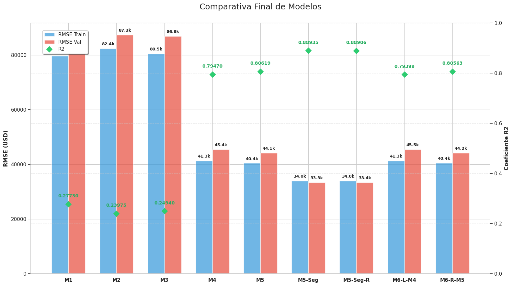

# Housing prices, from scratch

Linear regression built entirely in **NumPy** — no scikit-learn — on a housing dataset that secretly mixes **two markets** (Argentina and the US, with mixed units and price scales). The interesting part isn't the model: it's everything the data tries to do to you along the way.



## Highlights

- **Everything implemented by hand**: closed-form least squares (pseudo-inverse), gradient descent, L1/L2 regularization, k-fold cross-validation and stratified splitting live in [`src/`](src/) as a small, documented library.
- **The data fights back**: mixed units (m² vs sqft), corrupted targets, missing values, and a bimodal market structure that produces a textbook **Simpson's paradox** — property age correlates *negatively* with price globally (-0.37) but *positively* inside each country (+0.53 / +0.36).
- **Leakage-safe pipeline**: imputation statistics, normalization parameters and encoders are learned on the training split only, and the train/val split is stratified by country × price quartile.
- **Main finding**: with a structurally bimodal dataset, **segmenting beats regularizing**. Ridge/Lasso barely move the needle, while fitting one model per market cuts validation RMSE from ~44k to ~33k USD.

## Results

| Model | Val RMSE (USD) | Test RMSE (USD) | R² (test) |
|---|---|---|---|
| Best global model (50 features) | 44,103 | — | — |
| **Country-segmented model** | **33,324** | **32,383** | **0.876** |

The val–test gap is under 1k USD — the stratified split and the leakage-safe preprocessing pay off exactly where they should.

## Run it

```bash
pip install -r requirements.txt
jupyter lab notebooks/Entrega_TP1.ipynb   # narrative is in Spanish
```

The notebook ships with all outputs, so it reads fine without executing anything. `data/processed/` is regenerated on run.

---
<sub>Built while taking I302 — Machine & Deep Learning at Universidad de San Andrés (2026).</sub>
